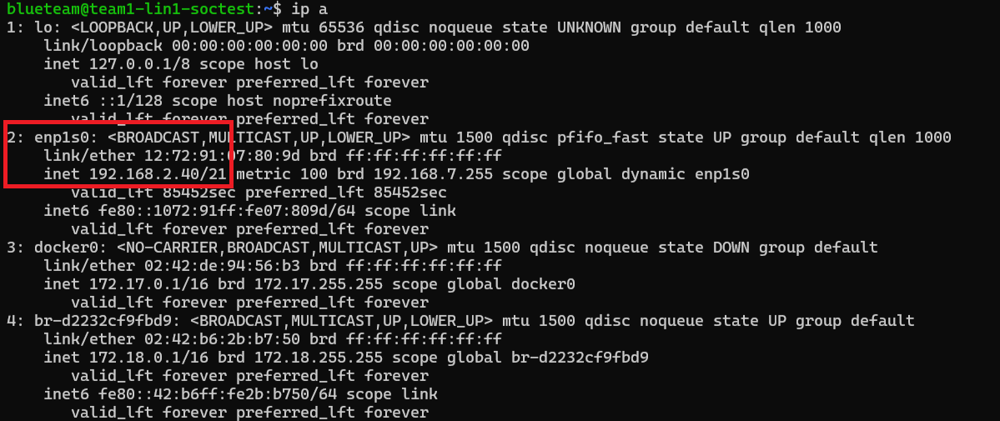

# Integration of Suricata into Wazuh
WHAT THIS IS:  
This guide installs and configures Suricata (Network IDS) with Wazuh on a Linux operating system. For more information/up to date information:  
[Wazuh Suricata Integration](https://documentation.wazuh.com/current/proof-of-concept-guide/integrate-network-ids-suricata.html)  


## 1. Linux Steps (Ubuntu only...?)

Install Suricata on the endpoint

```bash
sudo add-apt-repository ppa:oisf/suricata-stable
sudo apt-get update
sudo apt-get install suricata -y
```

Download and extract the Emerging Threats Suricata ruleset

```bash
sudo suricata-update
```
Command should show that the rules should be "enabled".  
  
To confirm this, the rules should show up in the ```/usr/share/rules/``` folder: 
  


> **Note:**
> If `suricata-update` does not work (rules are not added to the folder) try to add the ruleset manually with the following commands:
> ```bash
> cd /tmp/ && curl -LO https://rules.emergingthreats.net/open/suricata-6.0.8/emerging.rules.tar.gz
> sudo tar -xvzf emerging.rules.tar.gz && sudo mv rules/*.rules /var/lib/suricata/rules/
> cd ~
> cd /var/lib/suricata/rules
> sudo chmod 640 *.rules
> ```

After this, check the network interface on the machine\
(should be top left)\
Check the subnet range (convert subnet mask to CIDR notation)

```bash
ifconfig
```
or 
```bash
ip a
```
Image below shows what you should be looking for:  


Modify Suricata settings in `/etc/suricata/suricata.yaml`
Set following variables->

```bash
# This is your IP range here, Example: 192.168.0.1/21
HOME_NET: "[ubuntu-IP-LOW-Range/CIDR Notation]"
EXTERNAL_NET: "any"

# This line might be towards the bottom of the config
default-rule-path: /var/lib/suricata/rules
rule-files: 
- suricata.rules

# Global stats configuration
stats:
enabled: yes

# Linux high speed capture support
af-packet:
  - interface: <interface here>
```

Restart Suricata service
```bash
sudo systemctl restart suricata
```

Add following to the `/var/ossec/etc/ossec.conf` file on agent machine

```bash
<ossec_config>
  <localfile>
    <log_format>json</log_format>
    <location>/var/log/suricata/eve.json</location>
  </localfile>
</ossec_config>
```

Restart Agent
```bash
sudo systemctl restart wazuh-agent
```


## Troubleshooting ##

If your Suricata cannot find the rules files, you can add them manually in the ```/etc/suricata/suricata.yaml``` file, and manually copy them to the ```/var/lib/suricata/rules/``` location:
```bash
default-rule-path: /var/lib/suricata/rules/
rule-files:
- 3coresec.rules                  
- emerging-ftp.rules             
- emerging-scada.rules
- botcc.portgrouped.rules         
- emerging-games.rules           
- emerging-scan.rules
- botcc.rules                     
- emerging-hunting.rules         
- emerging-shellcode.rules
- ciarmy.rules                    
- emerging-icmp_info.rules       
- emerging-icmp.rules            
- emerging-snmp.rules
- drop.rules                      
- emerging-imap.rules            
- emerging-sql.rules
- dshield.rules                   
- emerging-inappropriate.rules   
- emerging-telnet.rules
- emerging-activex.rules          
- emerging-info.rules            
- emerging-tftp.rules
- emerging-adware_pup.rules       
- emerging-ja3.rules             
- emerging-user_agents.rules
- emerging-attack_response.rules  
- emerging-malware.rules         
- emerging-voip.rules
- emerging-chat.rules             
- emerging-misc.rules            
- emerging-web_client.rules
- emerging-coinminer.rules        
- emerging-mobile_malware.rules  
- emerging-web_server.rules
- emerging-current_events.rules   
- emerging-netbios.rules         
- emerging-web_specific_apps.rules
- emerging-deleted.rules          
- emerging-p2p.rules             
- emerging-worm.rules
- emerging-dns.rules              
- emerging-phishing.rules        
- threatview_CS_c2.rules
- emerging-dos.rules              
- emerging-policy.rules          
- tor.rules
- emerging-exploit_kit.rules      
- emerging-pop3.rules
- emerging-exploit.rules          
- emerging-rpc.rules
```
